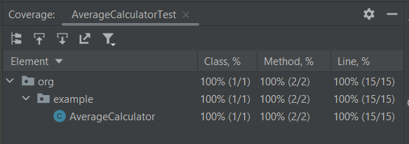

# Тесты для AverageCalculator

1. **testCompareAverage_FirstListGreater()** - Этот тест проверяет ситуацию, когда у нас есть два списка с разными средними значениями, при которых среднее первого списка больше среднего второго списка.
2. **testCompareAverage_SecondListGreater()** - Этот тест проверяет ситуацию, когда у нас есть два списка с разными средними значениями, при которых среднее второго списка больше среднего первого списка.
3. **testCompareAverage_AveragesEqual()** - Этот тест проверяет ситуацию, когда у нас есть два списка с разными средними значениями, при которых средние принимают равное значение.
4. **testCalculateAverage_EmptyList()** - Этот тест проверяет попытку расчета среднего с пустым списком.
5. **testCalculateAverage()** - Этот тест проверяет расчет среднего значения переданного в функцию списка.

# **Покрытие тестами**

